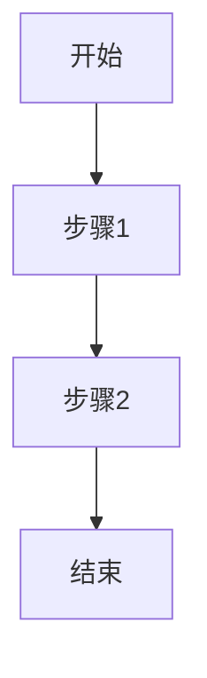

# 专业Markdown编辑器使用说明

## 功能特性

### 1. 现代化界面设计
- 左侧编辑区，右侧预览区的分栏布局
- 支持日间/夜间模式切换
- 响应式设计，适配不同屏幕尺寸

### 2. 实时预览与同步滚动
- 编辑内容实时渲染为HTML
- 编辑区与预览区同步滚动
- 支持全屏预览模式

### 3. 流程图渲染支持
- 集成Mermaid.js，支持多种图表类型：
  - 流程图 (Flowchart)
  - 时序图 (Sequence Diagram)
  - 甘特图 (Gantt Diagram)
  - 类图 (Class Diagram)
  - 状态图 (State Diagram)
  - 饼图 (Pie Chart)
- 自动识别并渲染 ```mermaid 代码块

### 4. 智能目录系统
- 自动从标题生成带层级序号的目录（如1, 1.1, 1.2, 1.2.1等）
- 支持至少三级标题编号
- 点击目录项可快速跳转到对应章节

### 5. 代码语法高亮
- 支持多种编程语言的语法高亮显示
- 自动识别代码块语言并应用相应高亮样式
- 支持常见的编程语言如JavaScript、Python、Java、C++等
- 日间模式采用GitHub Light主题，夜间模式采用Material Dark主题
- 使用等宽字体（Fira Code）以获得更好的阅读体验

### 6. 实用功能
- 本地存储自动保存功能
- 一键复制代码功能
- 字数和行数统计
- 内容下载功能

## 使用方法

### 基本操作
1. 在左侧编辑区输入Markdown内容
2. 右侧预览区会实时显示渲染效果
3. 点击"夜间模式"按钮可在日间和夜间主题间切换
4. 点击"全屏预览"按钮可进入全屏预览模式

### 流程图使用示例

使用Mermaid语法创建流程图：

````markdown

````

### 代码语法高亮使用示例

使用标准Markdown代码块语法，指定语言标识符：

````markdown
```javascript
// JavaScript示例
function helloWorld() {
  console.log('Hello, world!');
  return 42;
}
```

```python
# Python示例
def hello_world():
    print('Hello, world!')
    return 42
```

```java
/* Java示例 */
public class HelloWorld {
    public static void main(String[] args) {
        System.out.println("Hello, world!");
    }
}
```
````

### 目录使用说明
编辑器会自动从Markdown标题(H1-H6)生成目录：
- 一级标题(#) 对应编号 1, 2, 3...
- 二级标题(##) 对应编号 1.1, 1.2, 2.1...
- 三级标题(###) 对应编号 1.1.1, 1.1.2...

点击目录中的任意条目可快速跳转到对应章节。

## 技术实现

### 核心技术栈
- Vue.js 2.x
- Element UI
- Markdown-it 解析器
- Mermaid.js 图表渲染
- vue-splitpane 分栏组件
- highlight.js 代码语法高亮

### 主要特性实现

#### 1. 实时预览
使用Markdown-it解析器，配合防抖机制优化性能

#### 2. 同步滚动
通过计算编辑区和预览区的滚动百分比，实现双栏同步滚动

#### 3. Mermaid集成
通过动态加载CDN方式引入Mermaid.js，按需渲染图表

#### 4. 智能目录
解析HTML标题结构，生成带层级编号的目录

#### 5. 代码语法高亮
使用highlight.js库实现多种编程语言的语法高亮：
- 自动识别代码块语言
- 应用相应语法高亮样式
- 支持日间/夜间模式下的不同主题配色
- 日间模式：GitHub Light主题 (#f6f8fa背景)
- 夜间模式：Material Dark主题 (#282c34背景)

#### 6. 本地存储
使用localStorage实现内容的自动保存和恢复功能

## 支持的编程语言

代码语法高亮功能支持以下编程语言（部分）：
- JavaScript/TypeScript
- Python
- Java
- C/C++
- HTML/CSS
- SQL
- Bash/Shell
- Go
- Rust
- PHP
- Ruby
- Swift
- Kotlin
- And more...

## 主题配色方案

### 日间模式 (GitHub Light)
- 背景色: #f6f8fa
- 字体: 等宽字体 (Fira Code, Consolas, Monaco)
- 高亮规则:
  - 关键字: 蓝色 (#0366d6)
  - 注释: 灰色 (#6a737d) + 斜体
  - 字符串: 绿色 (#032f62)
  - 数字: 橙色 (#e36209)
  - 边框: 1px solid #e1e4e8
  - 圆角: 6px

### 夜间模式 (Material Dark)
- 背景色: #282c34
- 字体: 等宽字体 (带连字优化)
- 高亮规则:
  - 关键字: 荧光蓝 (#56b6c2)
  - 注释: 深灰色 (#7f848e) + 斜体
  - 字符串: 浅绿色 (#98c379)
  - 数字: 黄色 (#d19a66)
  - 边框: 1px solid #3e4451
  - 行高亮: 渐变背景 (#2c313a)

## 注意事项

1. 为保证最佳性能，建议内容不超过10000行
2. Mermaid图表较大时可能影响渲染性能
3. 夜间模式下部分图表可能需要重新渲染才能正确显示
4. 本地存储内容仅保存在当前浏览器中
5. 代码语法高亮依赖highlight.js库，确保网络连接正常以获取最佳效果
6. 代码块必须用围栏语法（三个反引号）包裹，并明确指定语言标识符
7. 注释需用该语言的标准语法标记（如 //、#、/* */），并确保高亮对比度